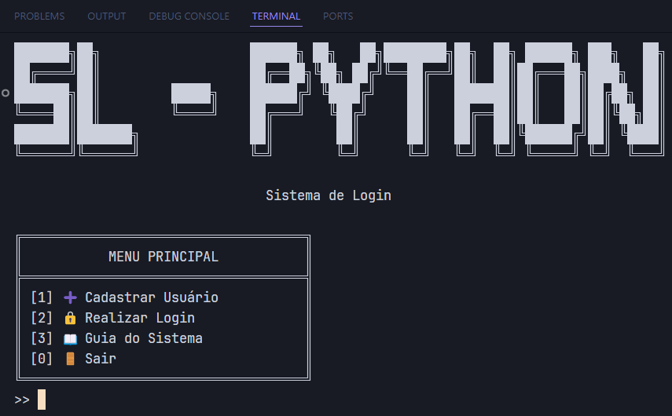

# 🔐 Sistema de Login

Um sistema completo de autenticação e gerenciamento de usuários desenvolvido em Python, que permite o cadastro, login e controle de usuários de forma segura e eficiente.

## 📋 Funcionalidades

### 👤 Gestão de Usuários
- **Cadastro**: Registro de novos usuários com validações
- **Login**: Autenticação segura de usuários
- **Atualização**: Modificação de dados cadastrais
- **Exclusão**: Remoção de usuários do sistema
- **Visualização**: Consulta de informações de usuários
- **Listagem**: Exibição de todos os usuários cadastrados

### 🔒 Segurança
- Senhas criptografadas
- Validação de força de senha
- Verificação de email único
- Controle de sessão de usuário

## 🛠️ Tecnologias Utilizadas

- Python 3.13.2
- SQLAlchemy (ORM)
- Bcrypt (criptografia)
- Questionary (interface de usuário)
- PostgreSQL (Banco de Dados)

## 📦 Instalação

1. Clone o repositório:
```bash
git clone https://github.com/andreLopes41/Sistema-Login
```

2. Instale as dependências:
```bash
pip install -r requirements.txt
```

3. Execute o sistema:
```bash
python view/main.py
```

## 🎯 Estrutura do Projeto

```
sistema-login/
├── controller/         # Controladores
│   └── user_controller.py
├── model/             # Classes e modelos
│   └── User.py
├── repository/        # Camada de persistência
│   ├── base.py
│   ├── session.py
│   └── user_repository.py
├── view/             # Interface do usuário
│   └── main.py      # Ponto de entrada
├── requirements.txt  # Dependências
└── README.md        # Documentação
```

### 📁 Descrição dos Diretórios

#### Controller
Contém a lógica de negócio da aplicação, implementando as regras de validação e controle de usuários.

#### Model
Define as estruturas de dados e entidades do sistema usando SQLAlchemy ORM.

#### Repository
Responsável pela persistência dos dados e operações no banco de dados.

#### View
Interface do usuário em modo texto, utilizando menus interativos.

## 🔄 Padrões de Projeto Utilizados

- **MVC (Model-View-Controller)**: Separa a aplicação em três camadas
- **Repository Pattern**: Abstrai a camada de persistência
- **Singleton**: Utilizado na conexão com banco de dados

## 🔒 Regras de Negócio

1. **Cadastro de Usuários**
   - Nome entre 3 e 50 caracteres
   - Email único e válido
   - Senha forte com requisitos mínimos

2. **Autenticação**
   - Verificação de credenciais
   - Controle de sessão
   - Proteção contra acessos não autorizados

3. **Gerenciamento**
   - Usuário logado não pode ser excluído
   - Validações em todas as operações
   - Persistência segura dos dados

## 🔍 Funcionalidades Principais

### Cadastro de Usuário
```python
def cadastrar_usuario(self, nome: str, email: str, senha: str):
    # Validações
    # Criptografia da senha
    # Persistência dos dados
```

### Login de Usuário
```python
def realizar_login(self, email: str, senha: str):
    # Verificação de credenciais
    # Controle de sessão
    # Retorno do status
```

## 🖼️ Interface do Sistema

